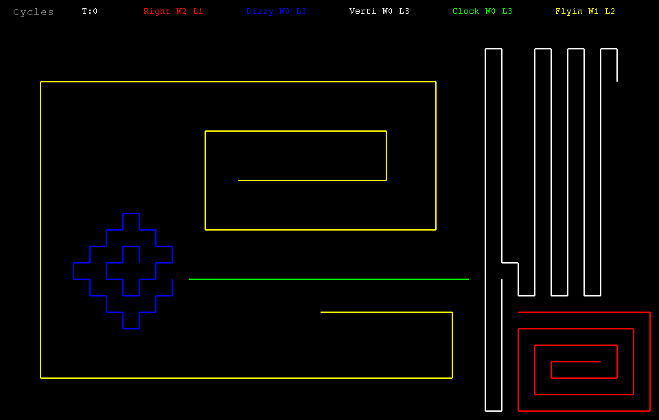

# Lark Cycles

This is a Python/Tkinter port of the 1988 Amiga programming game [_Warrior Cycles_](https://corewar.co.uk/warriorcycles.htm) by Rico Mariana.
In this port, the player logic is implemented in Starlark.
It demonstrates the use of [Starlark for Python](https://github.com/dbohdan/starlark-python).

The initial port was made by AI (Kimi K2.6) with only high-level human guidance.

## Screenshot



## Running

```shell
# In a cloned repository:
uv run python -m lark_cycles --scale 2

# Anywhere:
# 1. Install
pipx install git+https://github.com/dbohdan/lark-cycles
# or
uv tool install git+https://github.com/dbohdan/lark-cycles
# 2. Start
lark-cycles --scale 2
```
